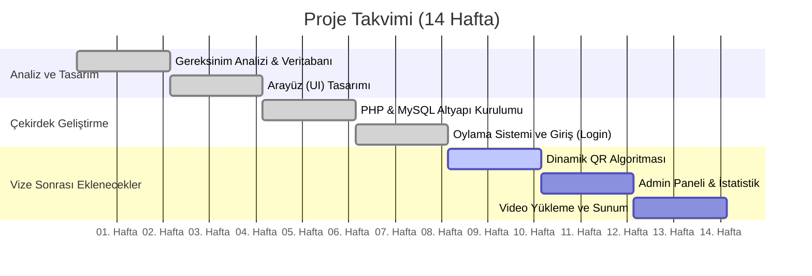
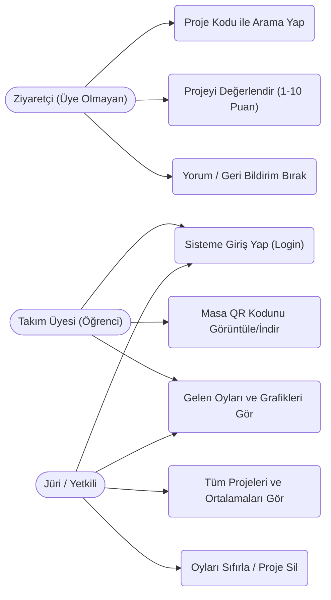
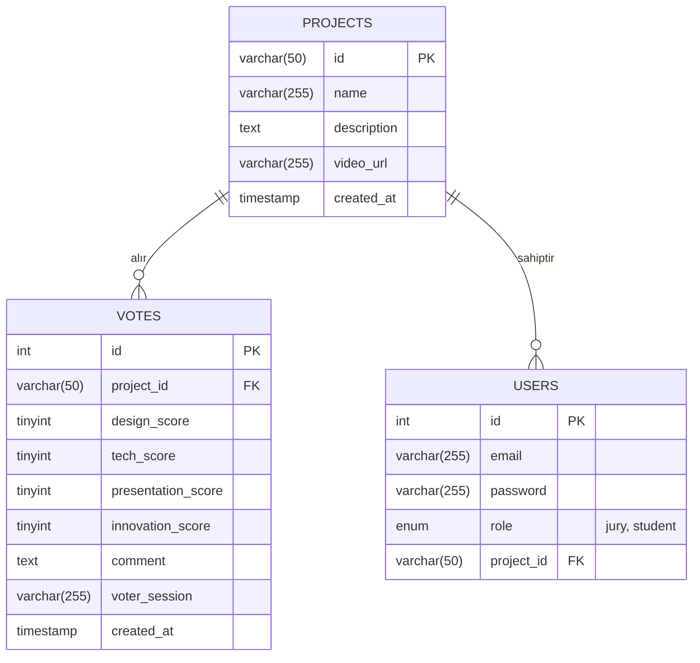
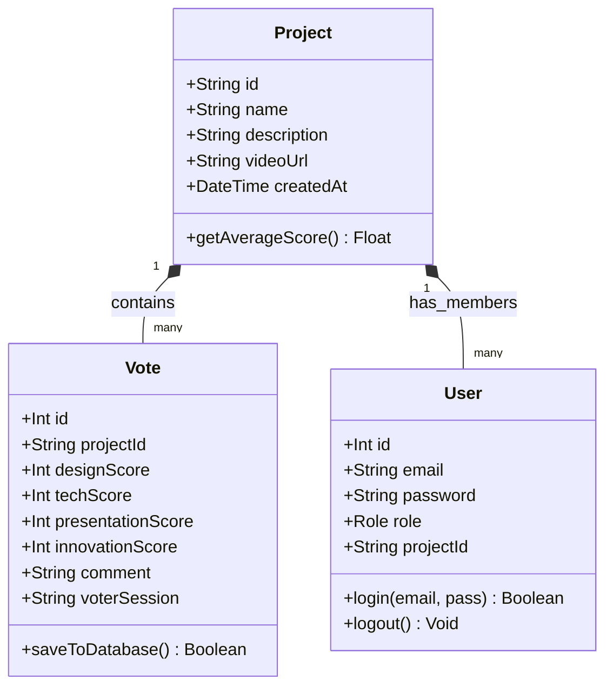

# T.C. İSTANBUL AREL ÜNİVERSİTESİ
**MESLEK YÜKSEKOKULU - BİLGİSAYAR PROGRAMCILIĞI PROGRAMI**
**2023-2024 / BAHAR DÖNEMİ MESLEKİ PROJE 1. ARA RAPORU**

**PROJE KODU:** (Okul tarafından verilecek kodu buraya giriniz)
**PROJE ADI:** Dinamik QR Kodlu Proje Puanlama Sistemi

**PROJE GRUBU:**
| ÖĞRENCİ NO | AD | SOYAD | İMZA |
| :--- | :--- | :--- | :--- |
| Öğrenci No Giriniz | Öğrenci Adı | Öğrenci Soyadı | [İmza] |

**PROJE DANIŞMANI:**
| AD SOYAD | İMZA |
| :--- | :--- |
| Öğr. Gör. (Hocanızın Adı) | [İmza] |

---

## 1. GANTT ŞEMASI

Projenin 14 haftalık çalışma planı ve vize (8. hafta) teslimine kadar geçen süre zarfında tamamlanan ve kalan aşamaları aşağıdaki Gantt şemasında gösterilmektedir:

## 2. UML KULLANIM DURUM (USE-CASE) ŞEMASI

Sistemdeki üç ana aktör (Ziyaretçi, Öğrenci ve Jüri) ve bu aktörlerin sistemle nasıl etkileşime girdiğini gösteren Kullanım Durum diyagramı aşağıdadır:

## 3. VERİTABANI VARLIK İLİŞKİ (E-R) ŞEMASI

Sistemde verileri tutmak için MySQL ilişkisel veritabanı kullanılmaktadır. Projeler, kullanıcılar ve verilen oylar arasındaki varlık ilişkisi aşağıdaki gibidir:

## 4. UML SINIF (CLASS) ŞEMASI

Veritabanı varlıklarının yazılım içindeki DTO (Data Transfer Object) benzeri sınıfsal veya model temsili şu şekildedir:

## 5. YAPILAN ÇALIŞMALAR

Vize teslim dönemi olan 8. haftaya kadar şu çalışmalar gerçekleştirilmiştir:
1.  **Teknoloji Yığını ve Altyapı Kararı:** İlk başta geliştirilmesi düşünülen sistem tamamen PHP (Saf) ve MySQL yapısına uyarlanmıştır. Frontend tarafında hızlı ve modern görünüm için Tailwind CSS entegre edilmiştir.
2.  **Veritabanı Tasarımı:** `database.sql` oluşturularak sistemin gereksinim duyduğu `projects`, `users` ve `votes` tabloları tasarlanmış, yabancı anahtarlar (foreign keys) üzerinden ilişkilendirmeleri sağlanmıştır.
3.  **Kullanıcı Arayüzü (Temel):** Projenin HTML/CSS mimarisindeki "Glassmorphism" odaklı ana sayfa ve değerlendirme sayfası tasarlanmıştır.
4.  **Oylama Motoru:** Üye olmadan tarayıcıdaki kişilerin puanlama yapabilmesi için PHP $_SESSION kimliğiyle çalışan oylama modülü yazılmıştır ("Tasarım", "Teknik", "Sunum", "İnovasyon" alanları için). Oylar MySQL veritabanına başarıyla INSERT edilebilmektedir.
5.  **Giriş Sistemi:** Jüri ve öğrencilerin sisteme girip (gelecekteki grafikleri görmek için) yönlendirildiği `login.php` modülü yazılmış ve Session tabanlı koruması aktif edilmiştir.

## 6. KARŞILAŞILAN SORUNLAR VE ÇÖZÜMLER

-   **Sorun:** Ziyaretçiler üye olmadan puanlama yaptığında, aynı cihaz üzerinden defalarca ardışık oy gönderilmesi (Spam yapılması) riski vardı.
    **Çözüm:** Kullanıcı siteye girdiği an PHP `session_id()` fonksiyonuyla tarayıcıya geçici bir kimlik atanmış ve veritabanı kontrolünde *"Eğer bu session_id daha önce bu projeye oy verdiyse yeni oyu reddet"* mantığı kurularak spam ihtimali minimuma indirilmiştir.

-   **Sorun:** Node.js, React ve Firebase mimarilerinin kısa zamanlı vize sunumu için çok kompleks ve bağımlılık sorunu (peer-dependency vb.) yaratan yapıda olması nedeniyle entegrasyon yavaşlamıştı.
    **Çözüm:** Sistemin özüne odaklanmak için sunucu taraflı, yerel olarak (XAMPP ile) çok kolay sunulabilen köklü **PHP & MySQL** diline pivot edilmiştir.

## 7. YAPILACAK ÇALIŞMALAR

9\. haftadan itibaren proje teslim sürecine kadar eklenecek olan geliştirmeler şunlardır:
1.  **Dinamik QR Kod Modülü:** Sistem PHP kütüphaneleri kullanılarak otomatik proje barkodu / QR kodu üretecek ve PDF olarak masaüstüne indirebilecektir.
2.  **Jüri Paneli İşlemleri:** Tüm oyların tek bir ekranda ortalama bazında sıralanıp (liderlik tablosu) görüntülenmesi, gerektiğinde oyların sıfırlanması.
3.  **Dinamik İstatistikler:** Oylama verilerinin "Chart.js" kütüphanesi yardımıyla öğrencilerin panellerinde pasta grafiği, çubuk grafik ve radar grafik formunda anlık yansıtılması.
4.  **Güvenlik:** Proje yayına geçerken şifrelerin maskelenmesi ve Injection açıklarının katı kontrollerden geçirilmesi.

## 8. KAYNAKÇA

*   PHP Resmi Dokümantasyonu (PDO Kullanımı): https://www.php.net/manual/tr/book.pdo.php
*   MySQL İlişkisel Veritabanı Dokümantasyonları: https://dev.mysql.com/doc/
*   Tailwind CSS Altyapı Modelleri: https://tailwindcss.com/docs
*   UML, Use-Case ve Yazılım Mühendisliği Planlama Notları.
